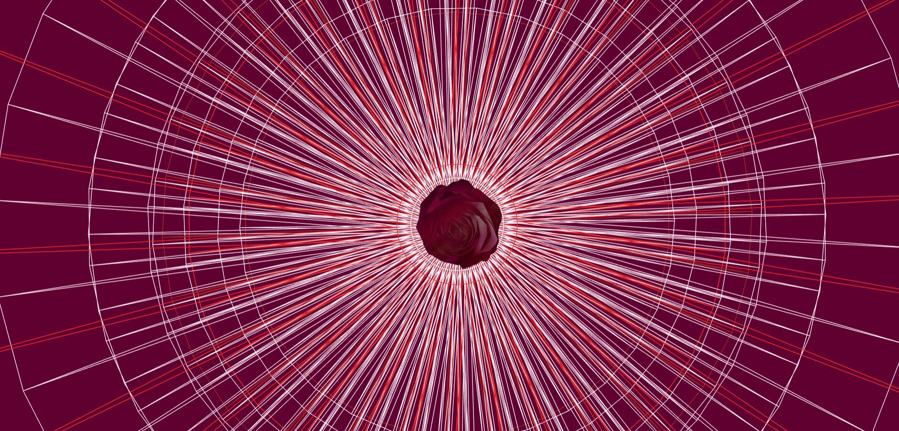
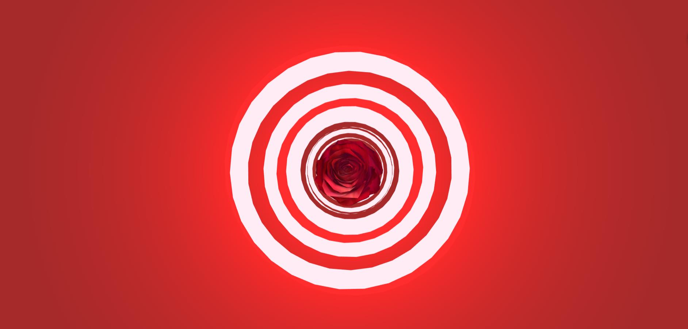
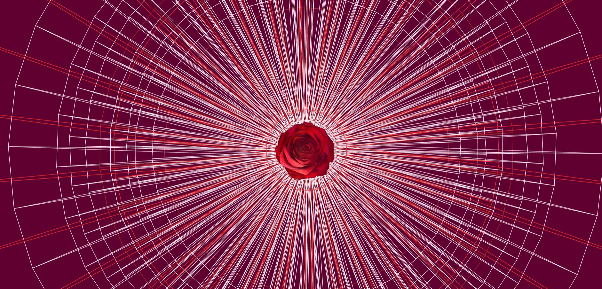

**La Vie En Rose**
========
### Jing Qian B161006075 ###

#### Links ####
[DAT505-Code Github](https://github.com/Fairyyyy12138/DAT505-GitHub/tree/master/Jing%20Qian-DAT505-Assignment)

#### final screen composition ####







#### An artistic work ####
This final project is intended to express the relationship between life and love. Rose symbolizes love, and the circles symbolize life. I use the 3D rose and flat circles to express my project.

At the beginning, I thought about how to express the concept of life in plane graphics. Later, I decided to use circles to express this idea, but the static circles seem unable to express the changing. So finally, I decided to use the variable and rotating circles.

At the same time, to use the 3D rose or the 2D rose also makes me very entangled.Finally, I decided to use the 3D red rose.So, I spent some time to model the red rose in 3ds Max.The completed red rose has 2930 polys.

#### Description ####
From my point of view, only the circulars' change were too monotonous, so I thought about the combination. Combining lines and surfaces makes the scene more abundant.I put the changing circle as the background, put the red rose in the middle, and let it rotate.I also set two different pointlights.

Simple visual performance may be too monotonous, so I want to combine vision and audition in my project.So I chose a song that matched the rhythm of the rotating circles.The name of the song is 'The Rose (Karaoke Version)',its name also fits the theme of my project.This song was sung by Ameritz Digital Karaoke.

#### file structure ####
* audio
  * Ameritz Digital Karaoke - The Rose (Karaoke Version).mp3
* build
  * three.js
  * three.min.js
* image
  * image1.jpg
  * image2.jpg
  * image3.jpg
  * image4.jpg  
* js
  * loaders
     * mtlLoader.js
     * OBJLoader.JS
     * TDSLoader.js
  * index.js
* model
  * obj
    * male02
      * rose.jpg
      * rose.mtl
      * rose.obj
* index.html
* README.md

#### Usage ####
```html
<script src='build/three.min.js'></script>
<script src="js/loaders/OBJLoader.js"></script>
<script src="js/loaders/MTLLoader.js"></script>
<script  src="js/index.js"></script>
```
* The code adds the audio and makes it loops.

```html
<audio src="audio/Ameritz Digital Karaoke - The Rose (Karaoke Version).mp3" autoplay loop >
</audio>
```
* The code creates a scene, a camera, defines window size, camera position and object.It also creates two pointlights and a renderer for the scene and camera.

```javascript
var camera, scene, renderer, composer;
var light;
var object;

init();
animate();
function init() {

// Set scene and camera
scene = new THREE.Scene();

var aspectRatio = window.innerWidth/window.innerHeight;

camera = new THREE.PerspectiveCamera(75,aspectRatio,0.1,10000);
// Move the camera
camera.position.z = 10;
camera.position.y = 0;

// Set the DOM
renderer = new THREE.WebGLRenderer({antialias:true});
renderer.setPixelRatio( window.devicePixelRatio );
renderer.setSize(window.innerWidth,window.innerHeight);
renderer.setClearColor("#600030");
document.body.appendChild(renderer.domElement);

object = new THREE.Object3D();
scene.add( object );

scene.add( new THREE.AmbientLight( 0xffffff ) );

window.addEventListener( 'resize', onWindowResize, false );
}

function onWindowResize() {
  windowHalfX = window.innerWidth / 2;
  windowHalfY = window.innerHeight / 2;
	camera.aspect = window.innerWidth / window.innerHeight;
  camera.updateProjectionMatrix();
	renderer.setSize( window.innerWidth, window.innerHeight );
	composer.setSize( window.innerWidth, window.innerHeight );
	}


function animate() {
	requestAnimationFrame( animate );
	object.rotation.x += 0.005;
	object.rotation.y += 0.01;
	}
// Point Light
var pointLight1 = new THREE.PointLight( "#FF0000", 100, 10 );
pointLight1.position.set( 0,0, 20 );
scene.add(pointLight1);

var pointLight2 = new THREE.PointLight( "#FC0202", 100, 10 );
pointLight2.position.set( 0,0, -20 );
scene.add(pointLight2);
```

* The code loads the OBJ model and its material.And adjusts the model to the right angle and rotate it. And controls the position of the rose.

```javascript
function loadModel() {
  object.traverse( function ( child ) {
    if ( child.isMesh ) child.material.map = texture;
  } );
  object.position.y = 0;
  object.position.z = 0;
  scene.add( object );

}

var myMaterials = [];
var rose ;
var onProgress = function ( xhr ) {
    if ( xhr.lengthComputable ) {
        var percentComplete = xhr.loaded / xhr.total * 100;
        console.log( Math.round(percentComplete, 2) + '% downloaded' );
    }
};
var onError = function ( xhr ) { };

var mtlLoader = new THREE.MTLLoader();
    mtlLoader.setPath( 'models/obj/male02/' );
    mtlLoader.load( 'rose.mtl', function( materials ) {
        materials.preload();
				for (var key in materials.materials){
					materials.materials[key].side = THREE.DoubleSide;
					myMaterials.push(materials.materials[key]);
				}


        var objLoader = new THREE.OBJLoader();
      	 	objLoader.setMaterials( materials );
      		objLoader.setPath( 'models/obj/male02/' );
       		objLoader.load( 'rose.obj', function ( object ) {

						rose = object;
            scene.add( rose );
            rose.position.set(0,0,0);
            rose.scale.set(1,1,1);
            rose.rotation.set(Math.PI/1.9,0,0.2);
        }, onProgress, onError );
    });

```

* The code sets a cantidad and variable i, to control the ringgeometry and the materials.

```javascript
var cantidad = 40;
var shapes = [];

for (var i = 0; i < cantidad; i++) {

    if(Math.random()<0.5){
        var geometry = new THREE.RingGeometry( 4, 40, 30 );
    }else{
        var geometry = new THREE.RingGeometry( 30, 30, 50 );
    }


    if(i%7===0){
        var material = new THREE.MeshPhongMaterial( { color: "#FF2D2D"} );
    }else if(i%2===0){
        var material = new THREE.MeshPhongMaterial( { color: "#A52A2A"} );
    }else{
        var material = new THREE.MeshPhongMaterial( { color: "#FFECF5"} );
    }
    var mesh = new THREE.Mesh(geometry,material);
    mesh.position.z = -i*1;
    mesh.rotation.z= i;
    shapes.push(mesh);
    scene.add(mesh);
}
```

* The code defines time as the variable and controls the rose rotates along the Y-axis. And controls the frequency of rotation of the circulars and the scale.

```javascript
var time = 0;

// Render function
var render = function(){
    requestAnimationFrame(render);
    time++;
//玫瑰花延Y轴旋转
	if(rose){

		rose.rotation.y -= 0.02;
	}

    for (var i = 0; i < cantidad; i++) {
        shapes[i].position.z+=0.2;
        shapes[i].rotation.z+=0.02;


        shapes[i].scale.x=1+Math.sin(i+time*0.1)*0.1;
        shapes[i].scale.y=1+Math.sin(i+time*0.1)*0.07;
        shapes[i].scale.z=1+Math.sin(i+time*0.1)*0.07;

        var valor = 0.5 + Math.sin(time*0.05)*5;

        if(Math.random()<valor){
            shapes[i].material.wireframe = true;
            shapes[i].material.wireframeLinewidth = Math.random()*3;
        }else{

            shapes[i].material.wireframe = false;
        }

        if(shapes[i].position.z>10){
            shapes[i].position.z = -70;
            shapes[i].rotation.z=i;
        }
    }
```

* The code controls the strength and position of the pointlights.

```javascript
pointLight1.intensity = Math.abs(Math.sin(time*0.2)*2);
pointLight2.intensity = Math.abs(Math.cos(time*0.2)*2);
pointLight1.position.z = Math.abs(Math.sin(time*0.02)*30);
pointLight2.position.z = Math.abs(Math.cos(time*0.02)*30);
```
